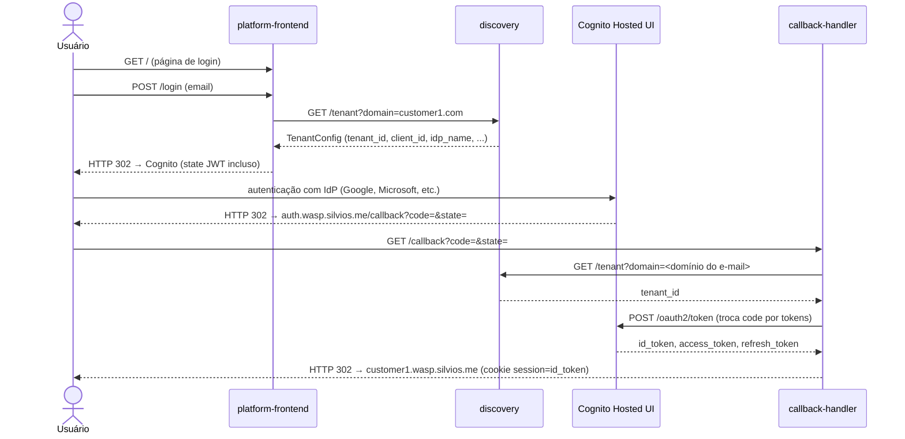

# Serviços

Três microserviços Python/FastAPI implementam o fluxo de autenticação multi-tenant da plataforma.

## Diagrama de interação



## Tabela de serviços

| Serviço | Namespace K8s | Subdomínio | Imagem Docker Hub |
|---|---|---|---|
| `discovery` | `discovery` | `discovery.wasp.silvios.me` | `silviosilva/wasp-discovery` |
| `platform-frontend` | `platform` | `wasp.silvios.me` | `silviosilva/wasp-platform-frontend` |
| `callback-handler` | `auth` | `auth.wasp.silvios.me` | `silviosilva/wasp-callback-handler` |

## Stack comum

- Python 3.12 + FastAPI + uvicorn
- Build: `--platform linux/amd64`; tag = git short SHA (nunca `:latest`)
- Cada serviço tem `.venv` próprio

## Executar localmente

```bash
cd lab/aws/eks/services/<serviço>
python3 -m venv .venv
.venv/bin/pip install -r requirements-dev.txt
.venv/bin/pytest tests/ -v
```

## Variáveis de ambiente por serviço

| Serviço | Variável | Descrição |
|---|---|---|
| `discovery` | `AWS_REGION` | Região AWS onde a tabela DynamoDB está |
| `discovery` | `DYNAMODB_TABLE` | Nome da tabela (ex: `tenant-registry`) |
| `platform-frontend` | `DISCOVERY_URL` | URL base do discovery (`https://discovery.wasp.silvios.me`) |
| `platform-frontend` | `COGNITO_DOMAIN` | Hostname do Cognito — **sem `https://`** (ex: `idp.wasp.silvios.me`) |
| `platform-frontend` | `CALLBACK_URL` | URL de callback OAuth (`https://auth.wasp.silvios.me/callback`) |
| `platform-frontend` | `STATE_JWT_SECRET` | Segredo compartilhado com `callback-handler` |
| `callback-handler` | `COGNITO_DOMAIN` | Hostname do Cognito — **sem `https://`** |
| `callback-handler` | `CALLBACK_URL` | URL registrada como `redirect_uri` no App Client |
| `callback-handler` | `DISCOVERY_URL` | URL base do discovery |
| `callback-handler` | `STATE_JWT_SECRET` | Segredo compartilhado com `platform-frontend` |
| `callback-handler` | `COGNITO_CLIENT_SECRET_CUSTOMER1` | Client secret do App Client do customer1 |
| `callback-handler` | `COGNITO_CLIENT_SECRET_CUSTOMER2` | Client secret do App Client do customer2 |
